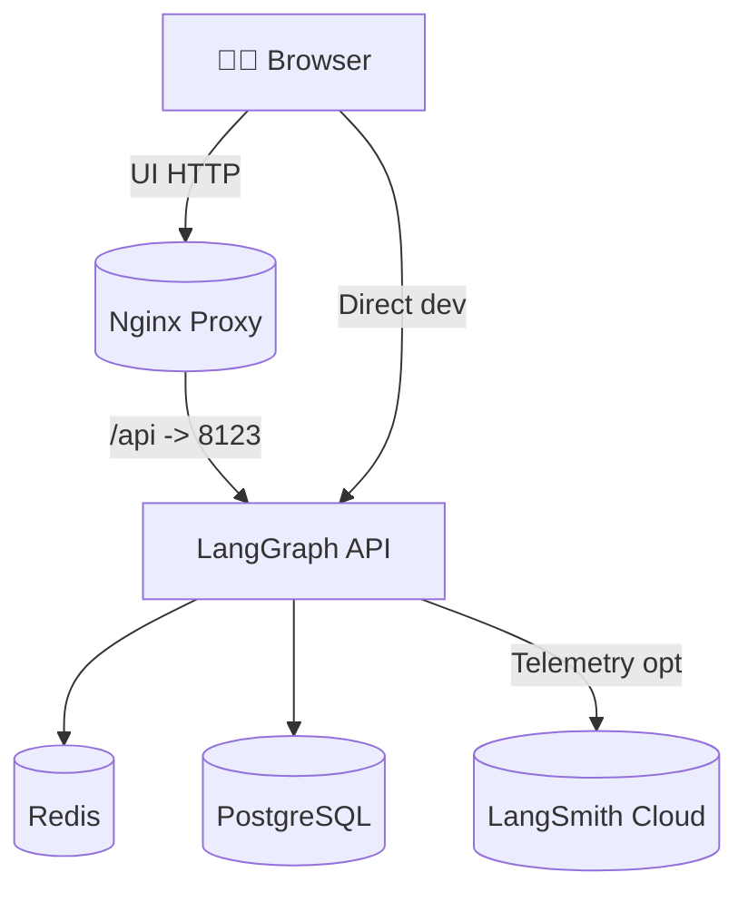
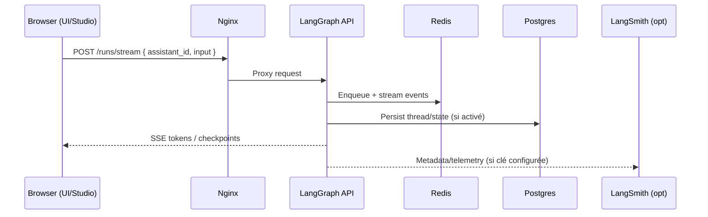

# 🚀 LangGraph Docker Stack - Tout-en-un

Une solution Docker complète pour développer, tester et déployer des agents LangGraph **sans aucune installation locale** (sauf Docker).

## ✨ Caractéristiques

- **Zero installation** : Juste `docker-compose up` et c'est parti!
- **Interface web locale** : Créez et éditez vos agents directement dans le navigateur
- **Stack complète** : PostgreSQL, Redis, API LangGraph, Interface web
- **Compatible Studio** : Fonctionne avec LangGraph Studio officiel
- **Mode développeur** : Pas besoin de licence pour tester

## 📦 Ce qui est inclus

1. **LangGraph API Server** : Le serveur principal qui exécute vos agents
2. **PostgreSQL** : Base de données pour la persistence
3. **Redis** : Gestion des tâches et streaming
4. **Interface Web** : Éditeur d'agents avec Monaco Editor
5. **Nginx Proxy** : Routing propre entre les services

## 🏁 Démarrage rapide

### 1. Configuration

Créez un fichier `.env` avec votre clé API:

```bash
OPENAI_API_KEY=sk-...
# ou
ANTHROPIC_API_KEY=sk-ant-...
```

### 2. Lancer la stack

```bash
# Méthode 1: Avec le script
chmod +x start.sh
./start.sh

# Méthode 2: Directement avec docker-compose
docker-compose up -d
```

### 3. Accéder aux interfaces

- **Interface Studio Local**: http://localhost
- **API LangGraph**: http://localhost:8123
- **Documentation API**: http://localhost:8123/docs

## 🎨 Interface Web Locale

L'interface web locale permet de:

### Créer des agents
1. Cliquez sur "+ Nouvel Agent"
2. Donnez un nom à votre agent
3. L'éditeur s'ouvre avec un template de base

### Éditer le code
- Éditeur Monaco (même que VS Code)
- Coloration syntaxique Python
- Auto-complétion de base

### Tester les agents
1. Sélectionnez l'onglet "Test"
2. Entrez un JSON d'entrée
3. Cliquez sur "Exécuter Test"
4. Voyez le résultat en temps réel


### Exemple d'agent minimal

Utilisez la syntaxe suivante pour que Studio détecte le mode Chat:

- messages dans l'état: `messages: Annotated[List[BaseMessage], add_messages]`
- retourner des messages `AIMessage`/`HumanMessage` depuis le nœud
- compiler le graphe et exposer `app`

**agent.py**:
```python
# agent.py
from typing import TypedDict, Annotated, List
from langgraph.graph import StateGraph, END
from langgraph.graph.message import add_messages
from langchain_core.messages import AIMessage, HumanMessage, BaseMessage

class State(TypedDict):
    # Strongly typed messages so schema includes LC message structure
    messages: Annotated[List[BaseMessage], add_messages]

def agent_node(state: State):
    last_user = None
    # Handle both LC messages and dicts defensively
    for m in reversed(state["messages"]):
        if isinstance(m, HumanMessage):
            last_user = m.content
            break
        if isinstance(m, dict) and m.get("role") == "user":
            last_user = m.get("content", "")
            break
    reply = f"Echo: {last_user}" if last_user else "Hello from echo agent"
    return {"messages": [AIMessage(content=reply)]}

graph = StateGraph(State)
graph.add_node("agent", agent_node)
graph.set_entry_point("agent")
graph.add_edge("agent", END)
app = graph.compile()
```

## 🔌 Intégration avec LangGraph Studio

Si vous préférez utiliser LangGraph Studio officiel:

1. Assurez-vous que l'API est lancée (port 8123)
2. Si le Chat ne fonctionne pas avec le port 8123, utilisez le proxy Nginx (qui ajoute les en-têtes CORS): https://smith.langchain.com/studio/?baseUrl=http://localhost:8123

On peut aussi utiliser (chemin par NGINX) https://smith.langchain.com/studio/?baseUrl=http://localhost:8080 ou https://smith.langchain.com/studio/?baseUrl=http://localhost/api

3. Ajoutez votre clé LangSmith côté API: export LANGSMITH_API_KEY=... (ou dans `.env`) afin d'activer l'affichage des runs
4. Studio se connectera à votre serveur local

## 🌐 Interfaces & URLs

- __UI locale (éditeur d’agents)__ — http://localhost
  - Créer/éditer les agents dans `agents/`
  - Tester via l’onglet "Test" (appelle l’API en local)

- __API LangGraph__ — http://localhost:8123
  - C’est une API, pas un site. La racine `/` renvoie "Not Found" (normal)
  - Documentation interactive: http://localhost:8123/docs
  - Utilisée par l’UI locale et par LangGraph Studio

- __LangGraph Studio (cloud)__ — https://smith.langchain.com/studio/?baseUrl=http://localhost:8123
  - Outil officiel pour visualiser et chatter avec vos graphs
  - Affiche les runs si `LANGSMITH_API_KEY` est défini côté API

Notes:
- Après ajout d’un nouvel agent, enregistrez-le dans `langgraph.json` à la racine puis redémarrez le service `langgraph-api`.
- Le fichier `langgraph.json` de l’hôte est monté dans le conteneur à `/app/langgraph.json`.

## 📝 API Endpoints

L'API LangGraph expose plusieurs endpoints:

- `POST /runs/stream` - Exécuter un agent en streaming
- `GET /assistants` - Lister les agents disponibles
- `POST /threads` - Créer une nouvelle conversation
- `GET /threads/{thread_id}/state` - Obtenir l'état d'une conversation

### Exemple d'appel API

```bash
curl -X POST http://localhost:8123/runs/stream \
  -H "Content-Type: application/json" \
  -d '{
    "assistant_id": "chatbot",
    "input": {
      "messages": [
        {"role": "human", "content": "Bonjour!"}
      ]
    }
  }'
```

## 🛠️ Commandes utiles

```bash
# Voir les logs de tous les services
docker-compose logs -f

# Logs d'un service spécifique
docker-compose logs -f langgraph-api

# Redémarrer un service
docker-compose restart langgraph-api

# Arrêter tout
docker-compose down

# Arrêter et supprimer les données
docker-compose down -v

# Reconstruire les images
docker-compose build --no-cache

# Voir l'état des services
docker-compose ps
```

## 🐛 Dépannage

### L'API ne démarre pas
- Vérifiez les logs: `docker-compose logs langgraph-api`
- Assurez-vous que PostgreSQL et Redis sont healthy
- Vérifiez que les clés API sont configurées

### Port déjà utilisé
- Changez les ports dans docker-compose.yml
- Ou arrêtez le service qui utilise le port

### "Cannot connect to Docker daemon"
- Assurez-vous que Docker Desktop est lancé
- Sur Linux: `sudo systemctl start docker`

## 🔒 Sécurité

⚠️ **Cette configuration est pour le DÉVELOPPEMENT uniquement!**

Pour la production:
- Activez l'authentification (`LANGGRAPH_AUTH_TYPE=bearer`)
- Utilisez HTTPS avec des certificats valides
- Configurez des mots de passe forts pour PostgreSQL
- Limitez l'accès réseau aux services

## 📚 Ressources

- [Documentation LangGraph](https://langchain-ai.github.io/langgraph/)
- [LangGraph Examples](https://github.com/langchain-ai/langgraph/tree/main/examples)
- [LangChain Academy](https://academy.langchain.com/courses/intro-to-langgraph)

## 🏗️ Architecture

Cette stack se compose de 5 services principaux, reliés par le réseau `langgraph-network`:

- __API LangGraph (`langgraph-api`)__: charge `langgraph.json`, expose `/runs/stream`, `/threads`, etc.
- __Redis (`langgraph-redis`)__: file d'attente interne, streaming et orchestration in-memory.
- __PostgreSQL (`langgraph-postgres`)__: persistence des runs/threads quand activée.
- __UI locale (`langgraph-ui`)__: éditeur d'agents (Monaco), tests via `/runs/stream`.
- __Nginx (`langgraph-proxy`)__: proxy optionnel (CORS, routage propre).



### Découverte des Graphs (assistants)
- Au démarrage, l'API lit `langgraph.json` (dans le conteneur: `/app/langgraph.json`).
- Dans ce repo, __le fichier hôte est monté dans le conteneur__ via `docker-compose.yml`:
  - `- ./langgraph.json:/app/langgraph.json:ro`
- Lorsqu’on ajoute un nouvel agent, on l’enregistre dans `langgraph.json` et on __redémarre le service API__ pour relire la config.
- Vérification rapide dans le conteneur:
  - `docker-compose exec langgraph-api cat /app/langgraph.json`

## 🔄 Flux d’exécution (Test/Chat)



### Schéma d’état côté agents
- Chaque agent expose `app` et un `State` avec `messages: Annotated[Sequence[AnyMessage], add_messages]`.
- Les autres champs d’état sont optionnels pour accepter `{ "messages": [...] }`.
- Le dernier nœud ajoute un `AIMessage` dans `messages` pour la compatibilité Chat.

## 💡 Tips & Tricks

1. **Hot Reload**: Les modifications dans l'interface web sont automatiquement rechargées
2. **Multiple Agents**: Créez autant d'agents que nécessaire dans le dossier `agents/`
3. **Partage**: Les agents peuvent être exportés et partagés comme dossiers
